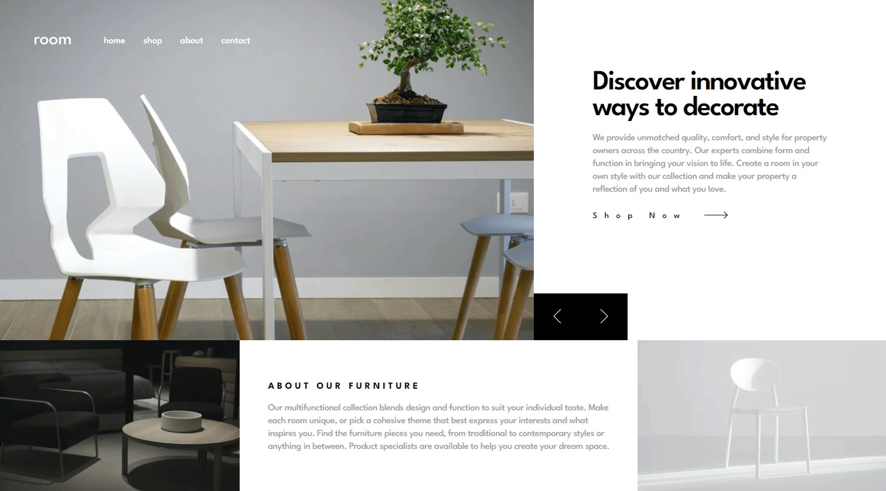
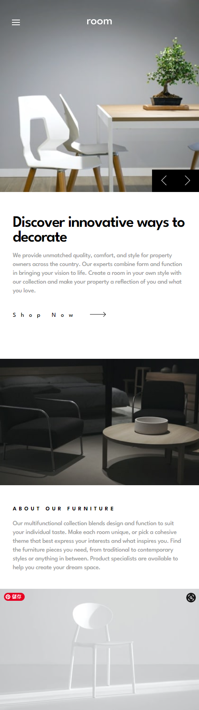

# Frontend Mentor - Room homepage

This is a solution to the [Room homepage challenge on Frontend Mentor](https://www.frontendmentor.io/challenges/insure-landing-page-uTU68JV8). 

## Screenshot

## Links

- Solution URL: [GitHub repo](https://github.com/TimWang95/room-homepage)
- Live Site URL: [solution Demo](https://main--radiant-dusk-efc6d4.netlify.app/#home)

## Built with

## What I Learnd
- Using useState to control the navbar menu and products index.
- Using `window.innerWidth` gets the inner width of the window.

## Author
- [GitHub](https://github.com/TimWang95)

- [Forntend Mentor](https://www.frontendmentor.io/profile/TimWang95)

## Acknowledgments

- Challenge was provided by [Frontend Mentor](https://www.frontendmentor.io/home)
